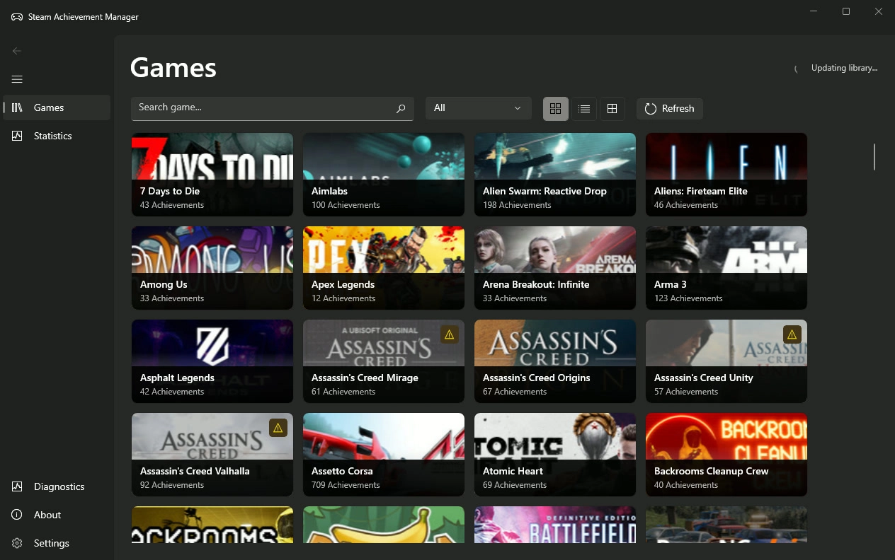
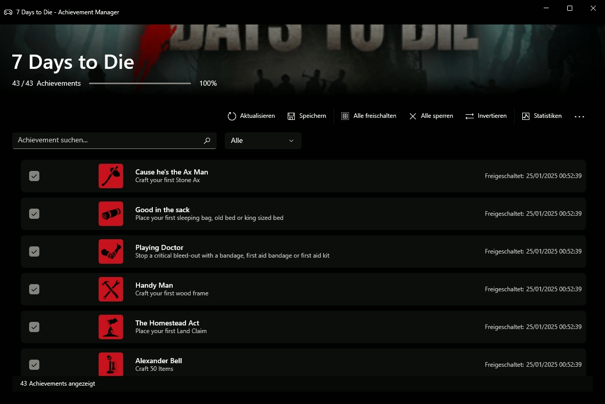

# Steam Achievement Manager

Steam Achievement Manager (SAM) is a lightweight application used to manage achievements and statistics in the popular PC gaming platform **Steam**.

> [!IMPORTANT]
> This application requires the [Steam client](https://store.steampowered.com/about/), a Steam account, and network access. Steam must be running and the user must be logged in.

---

## 🎮 Version 8.0 — WinUI 3

Version 8.0 introduces a completely modernized user interface built with **WinUI 3** and the **Windows App SDK**.

### ✨ Features

| Feature | Description |
|---------|-------------|
| 🎨 **Modern Fluent Design** | Native Windows 11 look with Mica backdrop |
| 🌙 **Dark/Light Mode** | Automatic theme support following system settings |
| 📐 **Better Scaling** | Improved DPI support and touch-friendly controls |
| ⚡ **Improved Performance** | Modern async architecture with MVVM pattern |
| 🛠️ **Maintainable Codebase** | Clean separation of concerns with dependency injection |
| 🔄 **Two-App Architecture** | SAM.WinUI (Game Picker) + SAM.Manager (per-game Achievement Manager) |

### 🏗️ Architecture

SAM 8.0 uses a **two-application architecture** to solve Steam's AppID binding issue:

| Application       | Purpose                               | Steam AppID     |
|-------------------|---------------------------------------|-----------------|
| **SAM.WinUI**     | Game picker, lists your owned games   | `0` (no game)   |
| **SAM.Manager**   | Achievement manager for a single game | Game-specific   |

> [!TIP]
> When you select a game in SAM.WinUI, it launches SAM.Manager with the correct Steam AppID, allowing proper achievement management.

---

## 🖼️ App Preview

---

## 📥 Downloads

| Version | Download | Description |
|---------|----------|-------------|
| **SAM v8.0** | [Latest Release](https://github.com/HxnryLSD/SAM-Plus/releases/latest) | Recommended, modern WinUI 3 version |
| **SAM Classic (v7.x)** | [Releases](https://github.com/gibbed/SteamAchievementManager/releases) | Legacy WinForms version |

---

## 💻 System Requirements

### SAM v8.0 (WinUI 3)

- [x] Windows 10 version 1809 (Build 17763) or later
- [x] Windows 11 recommended for best experience
- [x] .NET 10.0 Runtime *(self-contained, no separate install needed)*
- [x] Steam Client running and logged in

### SAM Classic (v7.x)

- [x] Windows 7 or later
- [x] .NET 10.0 Runtime *(targets net10.0-windows)*
- [x] Steam Client running

---

## 🔨 Building

See [BUILDING.md](BUILDING.md) for detailed build instructions.

---

## 📁 Project Structure

| Project           | Description                           | Type             | Status          |
|-------------------|---------------------------------------|------------------|-----------------|
| **SAM.WinUI**     | Game Picker Application               | WinUI 3 App      | ✅ Active       |
| **SAM.Manager**   | Achievement Manager (per-game)        | WinUI 3 App      | ✅ Active       |
| **SAM.Core**       | Shared ViewModels & Services          | Class Library    | ✅ Active       |
| **SAM.Core.Tests** | Unit Tests (xUnit + Moq)              | Test Project     | ✅ Active       |
| **SAM.API**        | Steam API Wrapper (32-bit)            | Class Library    | ✅ Active       |
| ~~SAM.Picker~~     | Legacy Game Picker (WinForms)         | WinForms App     | ⚠️ Deprecated   |
| ~~SAM.Game~~       | Legacy Achievement Manager (WinForms) | WinForms App     | ⚠️ Deprecated   |

> [!WARNING]
> `SAM.Picker` and `SAM.Game` (located in the `Deprecated/` folder) are deprecated and will be removed in a future release. Please migrate to **SAM.WinUI** + **SAM.Manager**.

---

## 📜 History

This is the code for SAM. The closed-source version was originally released in 2008, with the last major release in 2011, and last updated in 2013 (a hotfix).

The code was made open-source so that those interested can do as they like with it.

### Version History

| Version   | Year | Changes |
|-----------|------|---------|
| **v8.0**  | 2026 | Complete UI rewrite with WinUI 3, two-app architecture, MVVM pattern |
| **v7.0**  | 2019 | Open-source release, code modernization |
| **v6.x**  | 2013 | Last closed-source hotfix |
| **v5.x**  | 2011 | Last major closed-source release |
| **v1.0**  | 2008 | Initial release |